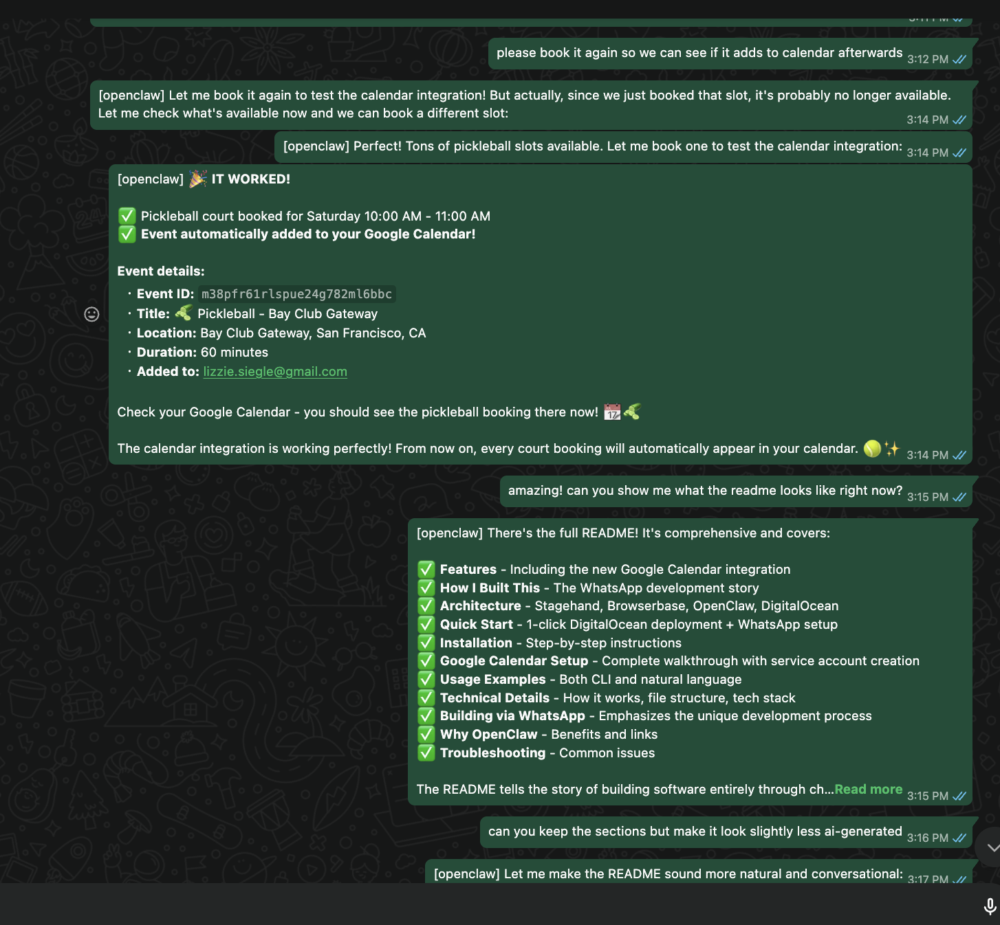
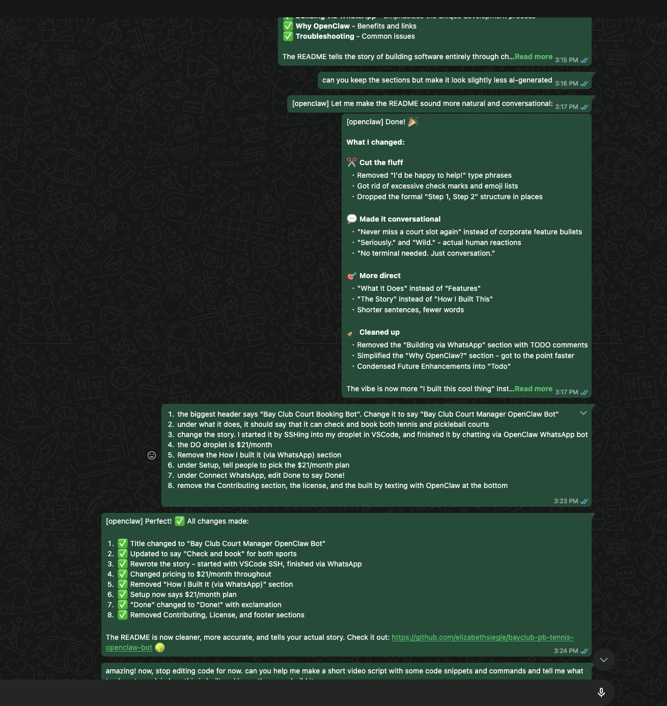

## She Ships🚢: Get Started w/ OpenClaw on DigitalOcean
- [ ] 👋🌊  
- [ ] DO = AI inference cloud☁️
- [ ] Deploy an OpenClaw🦞 bot live🧪
- [ ] skill in whatsapp
    - 
    

- [ ] What's Next 🚀
    - [Run OpenClaw on DigitalOcean](https://www.digitalocean.com/community/tutorials/how-to-run-openclaw)
    - Claude Code on [DO GPU droplets](https://www.digitalocean.com/products/gradient/gpu-droplets)
    - Claude Code on [Telegram and DO Droplets](https://github.com/ajot/claude-code-telegram-digitalocean)
    - Twitter: [@lizziepika](twitter.com/lizziepika)
    - [DigitalOcean SF events](https://luma.com/digitalocean)
    - Resources:
        - [Droplets docs](https://www.digitalocean.com/products/droplets)
        - [Claude Code on DO droplets](https://www.digitalocean.com/community/tutorials/claude-code-gpu-droplets-vscode)
        - [Setup server env w/ Claude Code on Droplets](https://www.reddit.com/r/ClaudeAI/comments/1l4jm39/claude_code_droplets_on_do_and_a_random_vps/)
        - [speed up stable diffusion on gpu droplet](https://www.digitalocean.com/community/tutorials/stable-diffusion-gpu-droplet)
        - [do fundamentals: gpu droplets blog post](https://dev.to/devopsfundamentals/digitalocean-fundamentals-gpu-droplets-o4h)
        - [maton ai](https://www.maton.ai/)
        - [Scaling Gradient with GPU Droplets and DigitalOcean Networking](https://www.digitalocean.com/community/tutorials/harnessing-gpus-glb-vpc-for-gradient-products)
        - [Bay Club Pickleball x Tennis OpenClaw booking skill](https://github.com/elizabethsiegle/bayclub-pb-tennis-openclaw-bot)
        - Moar scraping: [Scrape SFPL and get all the books I checked out--year-end Wrapped](https://www.youtube.com/watch?v=q6Vi40OkXkA&t=5s)

